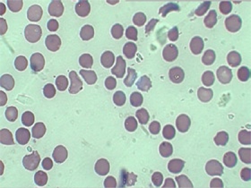

# Haematology MCQs  

---

# Coagulation Studies  

A previously healthy 68-year-old woman presents with spontaneous bleed into her psoas muscle. The results of coagulation tests are shown below. 

||Value|Reference range|
|---|---|---|
|Activated Partial Thromboplastin Time (APTT)|79|26 -38|
|APTT correction (immediate mix)|38|26 -38|
|APTT correction (2-h incubation)|79|26 -38|
|International normalised ratio (INR)|1.1|0.9 -1.2|
|Fibrinogen (g/L)|3.2|2.0 -4.0|

> Which of the following best accounts for these results? 

A. Von Willebrand Disease  
B. Disseminated intravascular coagulation (DIC)
C. Acquired Factor VIII inhibitor  
D. Chronic liver disease  
E. Haemophilia B  

---

## Acquired Factor VIII inhibitor  

The sudden appearance  of a large haemorrhage into the muscle in an elderly person with an elevated activated partial thromboplastin time (APTT) should raise the suspicion of an acquired factor VIll inhibitor (Franchini and Lippi, 2008). Patients often present with large haematomas, extensiIve ecchymoses or severe mucosal bleeding, including epistaxis, gastrointestinal bleeding and gross haematuria. Spontaneous haemarthroses are unusual. The cause is usually circulating autoantibodies directed against functional epitopes of factor VIll, causing neutralisation and/or its accelerated clearance from the plasma. There are associations with post-parturition, rheumatoid arthritis, systemic lupus erythematosus and underlying malignancies.

The APTT assay is a reliable screening test for factor VIll inhibitor detection as it is typically prolonged when factor Vll activity decreases to 45% of the mean normal level or less. Furthermore, mixing studies with patient plasma and normal  plasma do not normalise the APTT. Weak autoantibodies, however, may not prolong the APTT unless the mixture is incubated for at least 1 or 2h at 37°C.  

As a result, while mixing studies may show initial normalisation of APTT, repeat  
Studies after 1-2h of incubation typically shows that the APTT is prolonged again.  
Although von Willebrand disease may be diagnosed at an older age and is associated with prolonged APTT with normal PT and INR, there is usually personal and family history of bleeding. In coagulopathy due to chronic liver disease there will usually be an elevated INR and APTT. Haemophilia B, which usually presents a early age with characteristic spontaneous haemarthroses, is associated with  prolonged APTT with normal PT and INR. In acute disseminated intravascular coagulopathy (DIC) both APTT and INR are prolonged, while the fibrinogen levels are low due to rapid consumption

[https://doi.org/10.1182/blood-2008-03-143586](https://doi.org/10.1182/blood-2008-03-143586)

---

# Complete Blood Examination  

A 32-year-old woman presents to the emergency department with an 8-h history of severe right upper quadrant pain. An abdominal ultrasound reveals several mobile gallstones and gallbladder wall thickening, which is consistent with acute cholecystitis. The liver is unremarkable but the spleen measures 14cm. The cholecystitis improves with conservative management. On further questioning,  she tells you that her father had his spleen removed. The results of investigations and the blood film are shown below. 

||Value|Reference range|
|---|---|---|
|Haemoglobin (g/L)|111|115 -155|  
|Mean corpuscular volume (fL) |101|80 -98 |
|White blood cells (L) |8.1 &times;109|4.0 -11.0 &times;109|
|Platelet count (L)|190 &times;109|150 -400 &times;109|  |Reticulocyte count (%)|7|1 -3|  
|Bilirubin (&micro;gmol/L)|27|2 -24|

[Hug et. al., 2010](https://www.ncbi.nlm.nih.gov/pmc/articles/PMC2975852/)

> Which one of the following tests is the most appropriate next investigation?

A. Autoimmune profile   
B. Bone marrow biopsy   
C. Coombs test   
D. Osmotic fragility test   
E. Haemoglobin electrophoresis  

---

## Osmotic fragility test  

This patient's history is strongly suggestive of hereditary spherocytosis, which is associated with increased haemolysis and subsequent raised risk of qallstones seen here. Spherocytosis is caused by inherited defects in the membrane of red blood cells that reduce cell deformability. This leads to cells being removed by the spleen, which causes progressive splenic enlargement.  

Disease is mild in 20-30% of patients. As in this case, hereditary spherocytosis  
can present later in life. However, 60-70% of patients have more severe anaemia  
and splenomegaly, which leads to presentation in childhood. Hereditary spherocytosis is most commonly associated with dominant inheritance (75%). Mutations of genes eding ankyrin, spectrin,or Band 3 red cell proteins account for most cases.  

The diagnosis of hereditary spherocytosis is usually made on clinical grounds, based upon the presence of spherocytes on blood film. A number of tests are available for identifying individuals with hereditary spherocytosis:  

- Osmotic fragility testing  
- Ektacytometry  
- Acidified glycerol lysis test (AGLT)  
- Cryohaemolysis test  
- Eosin-5-maleimide binding test (EMA binding test).  

---

# Electric Headache  

A 60-year-old man has recently been diagnosed with B-cell non-Hodgkin lymphoma. He is waiting for chemotherapy to commence in 2 days. He suddenly develops headache, confusion, visual deterioration and epistaxis. Fundoscopy reveals retinal emorrhages. 

> Which one of the following investigations should be included in the evaluation?  

A. Complement levels    
B. C-reactive protein    
C. Plasma electrophoresis    
D. Serum free light chains    
E. Serum viscosity   

---

## Serum Viscosity

This patient's presentation is suspicious for hyperviscosity syndrome in the setting  
of a lymphoproliferative disorder and cryoglobulinaemia is a possible cause. B-cell lymphoproliferative diseases are the major cause of cryoglobulinaemiaassociated with malignancy. Type I cryoglobulinaemia is reported predomi associated  
nantly in patients with Waldenström macroglobulinaemia, multiple myeloma, or  
chronic lymphocytic leukaemia. Mixed cryoglobulinaemias occur mainly in B-cell  
lymphomas.  

Two major mechanisms are involved to a varying extent in the different types of cryoglobulinaemia: cryoglobulin precipitation in the microcirculation, and vascular  
immune complex-mediated inflammation. Vascular occlusion is more frequent in tvpe I cryoglobulinaemia, which is usually accompanied by high cryoglobulin concentrations, and can be associated with hyperviscosity syndrome and cold-induced acral necrosis. Immune complex-mediated vasculitis is more frequent in mixed cryoglobulinaemias, particular type II, in which the monoclonal lgM component generates large immune compiexes with lgG and complement fractions.  

Hyperviscosity syndrome develops mainly in patients with type I cryoglobulinaemia associated with haematological malignancies, and is uncommon in patients with mixed cryoglobulinaemia (<3%). The key symptoms are neurological (headache, confusion), ocular (blurred vision, visual loss) and ear and nose (epistaxis, hearing loss). The physical examination should include fundoscopy to exclude hyperviscosity-related retinal changes, including haemorrhages. In patients in  whom hyperviscosity syndrome is suspected, serum viscosity should be measured. Patients usually become symptomatic at viscosity measurements greater than 4.0  upoise (CP), but some patients are symptomatic with lower viscosities. Symptomatic hyperviscosity requires urgent treatment with plasma exchange.

Low complement levels (particularly C4) and raised titres of serum rheumatoid factor are commonly observed in mixed cryoglobulinaemias and can correlate with clinical symptoms. Cryoglobulin detection can be difficult given the requirement to maintain blood at 37°C prior to analysis. Hepatitis C (HCV) testing is important(antibodies and serum HCV-RNA detection) in patients with mixed cryoglobulinaemia. Testing for other viruses (hepatitis B virus, HIV) and autoimmune diseases(anti-nuclear, anti-DNA, anti-Ro/La, anti-citrullinated antibodies) is recommended, even in patients known to have HCV.

[https://doi.org/10.1016/S0140-6736(11)60242-0](https://doi.org/10.1016/S0140-6736(11)60242-0 "Persistent link using digital object identifier")

---

# Immobile  

A 52-year-old woman who had an ischemic stroke 12 months ago has residual neurological deficits was referred for evaluation of recurrent episodes proximal deep venous thrombosis (DVT) of the lower limbs in the last 10 months. The results of investigations are shown below. A bone marrow biopsy showed mild hyperplasia of erythrocytic borne marrow. Urine dipstick for blood was +++.  

||Value|Reference range|  
|---|---|---|
|Haemoglobin (g/L)|82|115 -155|
|Mean corpuscular volume (fL)|98|80 -98|
|Mean corpuscular haemoglobin (pg)|31|27-33|
|White blood cells (cells/L)|4.0 &times;109|4.0-11.0 &times;109 |
|Platelet count (cells/l)|93 &times;109|150-400 &times;109|
|Reticulocytes (%)|5.4|0.5 -1.5|
|Total bilirubin (&micro;mol/L)|50|2 -24|
|Lactate dehydrogenase (U/L)|944|110 -230|
|Coombs test|Negative||

> What is the most likely diagnosis?  

A. Anti-thrombin lll deficiency   
B. Haemolytic uraemic syndrome   
C. Paroxysmal nocturnal haemoglobinuria  
D. Homocysteinaemia   
E. Protein C deficiency  

---

## Paroxysmal Nocturnal Haemoglobinuria  

Paroxysmal nocturnal haemoglobinuria (PNH) is a rare haematopoietic stem cell  
disorder caused by a somatic mutation in a gene known as phosphatidylinositol glycan class A (PIGA) (Brodsky, 2009). It may arise de novo or in the setting of acquired aplastic anaemia. The product of the PIGA gene is required for the  biosynthesis of a glycolipid anchor that attaches a class of membrane proteins  known as glycosylphosphatidylinositol (GPI)-anchored proteins to the cell surface.  

The absence of GP-anchored proteins leads to complement-mediated intravascular haemolysis, because two important complement regulatory proteins (CD55 and CD59) are missing from PNH cells.  
Clinical presentations include acute intravascular haemolytic crisis, especially nocturnal, chronic haemolytic anaemia, haemoglobinuria, bone marrow failure and thrombosis. Haemolysis in PNH occurs intravascularly, leading to release of free haemoglobin, a potent nitric oxide scavenger. Depletion of nitric oxide contributes to fatigue, oesophageal spasm, thrombosis and male erectile dysfunction. 

In the past, PNH was diagnosed indirectly based upon the sensitivity of PNH red cells to lysis by complement (e.g. Ham test). However, the recognition of a deficiency of GP-linked proteins in PNH has resulted in the development of flow cytometric methods for diagnosis. Thrombosis, the leading cause of death from PNH, most commonly occurs in abdominal and cerebral veins, but arterial thrombotic episodes can occur. Therapeutic options include bone marrow transplantation and monoclonal antibody therapy with the terminal complement inhibitor, eculizumab. Eculizumab decreases haemolysis in PNH by binding to C5 and blocking the terminal portion of the complement cascade

[https://doi.org/10.1182/blood-2009-03-195966](https://doi.org/10.1182/blood-2009-03-195966)

---

# Necrotic Coagulation   

A 54-year-old obese woman presents with extensive deep venous thrombosis of her left leg. She has a family history of venous thromboembolism. She was  started on low-molecular-weight heparin and warfarin 10mg daily for 2 days. Within 72h, she developed necrotising skin lesions on her thighs without trauma.

> What underlying condition is she most likely to have?  

A. Anti-thrombin Ill deficiency 
B. Protein S deficiency  
C. Anti-phospholipid syndrom  
D. Protein C deficiency  
E. Homozygous factor V Leiden mutation

--

## Protein C Defiency

Protein C deficiency is associated with recurrent familial thrombosis. It is inherited as an autosomal dominant trait and heterozygotes present with venous thrombotic manitestations. A family history is  essential in assessing the association of a patient's deticiency with their risk of thrombosis.  

Patients with protein C deficiency are at high risk for warfarin-induced skin necrosis during initiation of therapy. Warfarin-induced skin necrosis occurs in the feet, buttocks, thighs, breasts, upper extremities and genitalia. The lesions usually begin as maculopapular lesions several days after initiation of warfarin and progress into bullous, haemorrhagic and necrotic lesions. The mechanism is thought to be that, following the initiation of warfarin, both protein C antigen and activity levels drop rapidly, compared with levels of other vitamin K-dependent factors, such as factors IX and X and prothrombin. Therefore, administration of warfarin to protein C-deficient individuals can cause a temporary exaggeration of the balance between pro-coagulant and anti-coagulant pathways; that is the early suppressive action of warfarin on protein C may not be counterbalanced by the anti-coagulant effect created by the decline in other vitamin K-dependent factors, thereby leading to a relative hypercoagulable state at the start of treatment. This leads to thrombotic occlusions of the microvasculature with resulting necrosis. Protein S deficiency and anti-thrombin Il|l are rarely asociated with wartarin  induced skin necrosis.

[DOI: 10.1056/NEJM200104193441607](https://www.nejm.org/doi/full/10.1056/NEJM200104193441607?casa_token=d70AaDEm-GEAAAAA:hV5MAkAHRwZp30VK_BbDJx-RD6IRqpwd9JkaeTw2_6hPGAt53MaxA8eJU7-AoDaR8-OqT711eBS5evA)

---

# HUSKY  

> Which one of the following is correct concerning atypical haemolytic uraemic  
syndrome (aHUS)?  

A. It is only an acute disease   
B. It is predominantly (>80%) a condition affecting children   
C. It is associated with mutations in genes encoding complement regulatory proteins   
D. It is due to mutations in the gene encoding ADAMTS13   
E. Plasma exchange is the only eftective treatment  

---

## Associated with Complement regulatory genes  

Atypical haemolytic uraemic syndrome (aHUS) is a genetic, chronic, systemic and  potentially life-threatening disease affecting both adults and children. It is associated with mutations in genes encoding both complement regulators (factor H, factor l, membrane cofactor protein and thrombomodulin) and activators (factors B and C3), and autoantibodies against factor H. Diagnosis of aHUS does not require identification of a genetic mutation, as genetic mutations are not identified in 40% of patients with aHUS. Due to permanent genetic mutations, aHUS is an ongoing, lifelong disease of systemic complement-mediated thrombotic microangiopathy (TMA). Approximately half of the patients with aHUS are adults.  

Renal injury occurs in aHUS but other viial organ systems, including the cardiac and neurological system, are also afrted The related condition thrombotic thrombocytopenic purpura (TTP) restults from a deficiency of ADAMTS13, a plasma metalloprotease that cleaves von Willebrand factor.

[https://doi.org/10.1182/asheducation-2011.1.15](https://doi.org/10.1182/asheducation-2011.1.15)

---

# Liquidated  

The results of a patient's biochemistry profile after chemotherapy for Burkitt lymphoma are shown below. He was transferred to the intensive care unit for cardiac monitoring and treatmernt.

||Value|Reference range|
|---|---|---|
|Potassium (mmol/L)|6.8|3.4 -4.5|
|Phosphate (mmol/L)|2.4|0.70 -0.95|
|Corrected calcium (mmol/L)|1.60|2.10 -2.55 |
|Urate (mmol/L)|0.87|0.45 -0.60|
|Creatinine (&micro;mol/L)|348|60 -120|

> Which one of the following treatment options  should be used to lower uric acid level?

A. Aggressive intravenous diuretics   
B. Allopurinol   
C. Rasburicase   
D. Urinary alkalinisation   
E. Prednisolone  

---

## Rasburicase  

The patient's clinical tumour lysis syndrome is a result of chemotherapy for a highily  aggressive mature B-cell lymphoma. As such, the patient developed acute kidney injury, hyperkalaemia, hyperphosphataemia, secondary hypocalcaemia (caused by hyperphosphataemia) and hyperuricaernia Tumour lysis syndrome is seen in patients treated for bulky tumours and extensive metastasis, or with a high rate of proliferation of cancer cells, cancer cell sensitivity to therapy and an intensive cancer treatment regime.

A persistently high uric acid level ircreases the risk of crystal formation and acute renal injury. Supportive treatment, including intravenous fluids (not diuretics!) and cautious monitoring of the electrolyte imbalance to prevent cardiac  dysrhythmias and neuromuscular irritability, should be supplemented with treatment to lower the level of uric acid.  

Rasburicase removes uric acid by enzymatically degrading it into allantoin, a  
highly soluble product that has no known adverse effects. The use of rasburicase can preserve or improve renal function and lower phosphorus levels as a secondary beneficial effect.  

Allopurinol is xanthine oxidase inhibitor. It prevents the conversion of hypoxanthine and xathine into uric acid but does not remove existing uric acid. Allopurinol has also shown to worsen serum creatinine level (by 12%) compared to rasburicase, which improved creatinine level (by 31%). Where rasburicase is available, it is the recommended solution over the use of allopurinol in patients with high risk of or clinically established tumour lysis  syndrome.

[DOI: 10.1056/NEJMra0904569](https://www.nejm.org/doi/full/10.1056/nejmra0904569?casa_token=ceDdzQKLkjQAAAAA:33qDjdveVf2IWDneeTmt35g7_ul7bJBiidZSjPuZqPmvLGNMeQ7YVF7gM-xNCInELDHftC6WqbdkTI0)
[Management of hyperuricaemia with rasburicase review](https://doi.org/10.1081/NCN-200027656)

---

# Elective Knockout  

A 68-year-old woman is recovering from an elective knee replacement surgery for osteoarthritis. She has been receiving unfractionated heparin 5000 units twice a day. On day 10 she is breathless and computed tomographic pulmonary angiography shows bilateral pulmonary embolism. Laboratory investigation reveals a haemoglobin of 95 g/L (115-155 g/L) and platelet count of 45 &times;109 
cells/L (150-450 &times;109cells/L).  

> What additional diagnostic investigation should be undertaken?  

A. Extractable nuclear antibodies  
B. Activated partial thromboplastin time  
C. Anti-phospholipid antibodies  
D. Anti-platelet factor-4/heparin antibodies  
E. Anti-thrombin ll levels

---

## Anti-Platelet Factor-4/Heparin antibodies 

Heparin-induced thrombocytopenia (HIT) is caused by antibodies against complexes of platelet factor 4 (PF4) and heparin (Arepally and Ortel, 2006). Patients classically present with a lovw platelet count or a relative decrease of 50% or more from baseline. Thrombotic complications develop in approximately 20-50% of patients. Risk of thrombosis remains high for days to weeks after discontinuation of heparin, even after normalisation of platelet count. The incidence of HIT is 10 times higher in patients ireated with unfractionated heparin compared to those receiving low-moleculartight heparin. The incidence of HIT appears particularly high after orthopaedic sigery. Venous thromboses predominate in medical and orthopaedic patients, whe:eas arterial and venous thromboses occur at similar frequency in patients who have undergone cardiac or vascular surgery.  

Laboratory tests play an important role in the diagnosis of HIT because of the challenges of clinical diagnosis. When HIT is suspected, testing for heparin-dependent antibodies is indicated with immunological assays, which identify Circulating anti-PF4/heparin antibodies irrespective of their capacity to active platlets or functional assays, which detect patient antibodies that induce heparin-dependent platelet activation or both. Immunological assays detect circulating IgG, lgM, and lgA antibodies and are the first-line screening test. The major short-coming of the immunological assays is limited specificity. False-positive results are  common and may result from detection of non-pathogenic anti-PF4/heparin anties or anti-phospholipid antibodies against either PF4 or PF4-bound beta-2 -glycoprotein I. Functional assavs measure platelet activation and detect heparin  
upendent antibodies capable of binding to and activating Fc receptors on platelets. 

The most extensively studied functional tests for HIT diagnosis are the 14C-serotonin release assay (SRA) and heparin-induced platelet activation assdy (HIPA), Both tests are signiticantly more specific than exIsting immunoassavs and  are useful for confirming a positive immunologIcal assay. Untortunately, technical requirements restrict their use to a small number of reterence laboratories. As such, they commonly do not provide resulits in the real time necessary to guide initial management.

[DOI: 10.1056/NEJMcp052967](https://www.nejm.org/doi/full/10.1056/nejmcp052967?casa_token=IDPhOGDcSU8AAAAA:cp0vy48LKVCUHVPwaTlnEuPURvsuybrGyqu4xy9J8_s4sZMfHzYIKGtr4MLuAyLWikMb2HpQt87wxFo)

---

# Trivial Anaemia  

30-year-old woman with known hypoparathyroidism and Addison disease has been found to have a mutation in the autoimmune regulator (AIRE) gene and has become progressively. What cause of anaemia should be considered?

A. Haemolytic anaemia  
B. Pure red cell aplasia  
C. Iron-deficiency anaemia  
D. Pernicious anaemia  
E. Beta-thalassaemia minor  
F. Sideroblastic anaemia  
G. Anaemia of chronic disease  
H. Sickle cell disease

---

## Pernicious Anaemia  

Mutations in an autoimmune-Suppressor gene (AlRE, for autoimmune regulator),  
which encodes a trarnscriptior ctor, is responsible for autoimmune polyendocrine Syndrome type I. Individuals with any two of the following conditions- mucocutaneous candidiasis, hypoparathyroidism, and Addison disease are likely to have AIRE mutations. 

Mutations to this gene cause many autoimmune diseases and attected patients are at risk for the development of multiple autoimmune diseases over time, including Pernicious anaemia, as well as Type 1 diabetes, hypothyroidism, alopecia, vitiligo, hepatitis, ovarian atrophy and keratitis.

[https://doi.org/10.1038/nrendo.2010.40](https://www.nature.com/articles/nrendo.2010.40#Ack1)

---

