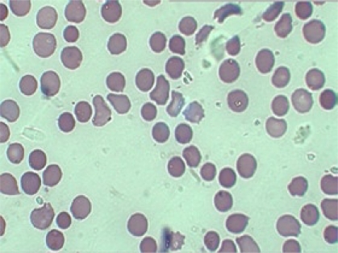

# HAEMATOLOGY  

---

## Question One 

A previously healthy 68-year-old woman presents with spontaneous bleed into her psoas muscle. The results of coagulation tests are shown below. Which of the following best accounts for these results? 

||Value|Reference range|
|---|---|---|
|Activated Partial Thromboplastin Time (APTT)|79|26 -38|
|APTT correction (immediate mix)|38|26 -38|
|APTT correction (2-h incubation)|79|26 -38|
|International normalised ratio (INR)|1.1|0.9 -1.2|
|Fibrinogen (g/L)|3.2|2.0 -4.0|

A. Von Willebrand Disease  
B. Disseminated intravascular coagulation (DIC)
C. Acquired Factor VIII inhibitor  
D. Chronic liver disease  
E. Haemophilia B  

---

## Answer One 

> A previous healthy 68-year-old woman presents with spontaneous bleed into her psoas muscle. The results of coagulation tests are shown below. Which of the following best accounts for these results? 

Acquired Factor VIII inhibitor

---

## Question Two  

A 78-year-old woman is found incidentally to have a lymphocyte count of 20.0 &times; 109/L (0.5 -3.5 &times; 109/L) on full blood count examination before her elective right knee replacement. On examination, there is no lymphadenopathy, splenomegaly, or hepatomegaly. Her haemoglobin is 114 g/L (115 -155 g/L) and platelet count is 220 &times; 109/L (120 -400 &times; 109/L). Lymphocyte surface markers reveal expression of CD5, CD19, CD20, and CD28. What management should she receive? 

A. Chlorambucil after bone marrow biopsy  
B. Alemtuzumab after computed tomography scan for staging  
C. Observation without bone marrow biopsy  
D. Fludarabine without bone marrow biopsy   
E. Lenalidomide after molecular study  

---

## Answer Two 

---

## Question Three  
A 32-year-old woman presents to the emergency department with an 8-h history of severe right upper quadrant pain. An abdominal ultrasound reveals several mobile gallstones and gallbladder wall thickening, which is consistent with acute cholecystitis. The liver is unremarkable but the spleen measures 14cm. The cholecystitis improves with conservative management. On further questioning,  she tells you that her father had his spleen removed. The results of investigations and the blood film are shown below. Which one of the following tests is the most appropriate next investigation?

||Value|Reference range|
|---|---|---|
|Haemoglobin (g/L)|111|115 -155|  
|Mean corpuscular volume (fL) |101|80 -98 |
|White blood cells (L) |8.1 &times;109|4.0 -11.0 &times;109|
|Platelet count (L)|190 &times;109|150 -400 &times;109|  |Reticulocyte count (%)|7|1 -3|  
|Bilirubin (&micro;gmol/L)|27|2 -24|

A. Autoimmune profile   
B. Bone marrow biopsy   
C. Coombs test   
D. Osmotic fragility test   
E. Haemoglobin electrophoresis  

---

## Answer Three 

---

## Question Four  

Which one of the following is correct in a patient with severe aplastic anaemia?  

A. Patients with severe aplastic anaemia usually present with severe infection at initial presentation  
B. Megakaryocytes are not helpful in distinguishing myelodysplastic syndrome from severe aplastic anaemia  
C. Aplastic anaemia and paroxysmal nocturnal haemoglobinuria rarey overlap (1% of cases)  
D. The appearance of bone marrow in inherited and acquired aplasuc anaemia is identical  
E. Change in leucocytes telomere length is not associated with severe aplastic anaemia

---

## Question Five  

A 60-year-old man has recently been diagnosed with B-cell non-Hodgkin lymphoma. He is waiting for chemotherapy to commence in 2 days. He suddenlvfusion, visual deterioration and epistaxis. Fundoscopyreveals retinal emorrhages. Which one of the following investigations should be included in the evaluation?  

A. Complement levels   
B. C-reactive protein   
C. Plasma electrophoresis   
D. Serum free light chains   
E. Serum viscosity   

---

## Answer Five 

---

## Question Six  

Which one of the following factors should be taken into account when termining the dose of an iron-chelating agent in a patient who is red bloodcell transfusion dependent because of myelodysplastic syndrome?  

A. Presence of cardiac iron overload   
B. Presence of splenomegaly   
C. Haemoglobin level   
D. Mean corpuscular volume   
E. Pain at the site of subcutaneous infusion   

---

## Answer Six 

---

## Question Seven  
 
Which one of the following statements best describes the role of sup>18F-fluorodeoxyglucose (18F-FDG) positron emission tomography (PET) in the evaluation of adults with Hodgkin lymphoma?  

A. Detects metabolically inactive tumour tissue   
B. Determines the most appropriate combination chemotherapy  
C. Diagnosis of the condition   
D. Disease staging   
E. ldentifies patients who need chemotherapy only  

---

## Question Eight  

A 34-year-old primigravida is found have a low platelet count (see below)on a full blood examination performed at weeks of gestation. Her platelet count  
was 180 x10 at 12 weeks of gestation. heas no significant past medical historyand is not taking any medications. Her oixod pressure is 105/70mmHg. Her other  
investigation results are shown below. Her liver function tests are normal. Which of  
one of the following is the most likely cause of her thrombocytopenia?  

||Value|Reference range| 
|---|---|---|
|Haemoglobin (g/L)|108|115 -160|
|White blood cell count (cells/L) |4.3 x 10 |3.2-11.0 x 10  |
|Platelet count (cells/L)  |80 x 10 |150-450 x 10  |
|Mean corpuscular volume (fL) |80|82 -98|
|Reticulocyte count (%)|1.8|0.8 -2.0|
|Urinary analysis (mg/L) |Protein 30|Negative |
|Serum creatinine (&micro;mol/L)|61|70 -110|
|Lactate dehydrogenase (UL)|173|70-250|

A. Haemolysis, elevated liver enzymes and low platelet (HELLP) Syndrome    
B. Pre-eclampsia   
C. Evan syndrome   
D. Thrombotic thrombocytopenic purpura   
E. Gestational thrombocytopenia  

---

## Question Nine  

A 52-year-old woman who had an ischemic stroke 12 months aao hue  
residual neurological deficits was referred for evaluation of recurrent enisodoe  
proximal deep venous thrombosis (DV) of the lower limbs in the last 10 monsh  
The results of investigations are shown below. A bone marrow biopsy showed  
mild hyperplasia of erythrocytic borne marrow. Urine dipstick for blood was +++.  
What is the most likely diagnosis?  

||Value|Reference range|  
|---|---|---|
|Haemoglobin (g/)|82|115 -155|
|Mean corpuscular volume (fL)|98|80 -98|
|Mean corpuscular haemoglobin (pg)|31|27-33|
|White blood cells (cells/)|4.0 |4.0-11.0 x 10 |
|Platelet count (cells/l)|93 &times; 10|150-400 x 10 |
|Reticulocytes (%)|5.4|0.5 -1.5|
|Total bilirubin (&micro;mol/L)|50|2 -24|
|Lactate dehydrogenase (U/L)|944|110 -230|
|Coombs test|Negative||

A. Anti-thrombin lll deficiency   
B. Haemolytic uraemic syndrome   
C. Paroxysmal nocturnal haemoglobinuria  
D. Homocysteinaemia   
E. Protein C deficiency  

---

## Answer Nine  

---

## Question Ten  

Which one of the following factors is the most important risk factor for acute graft-versus-host disease after allogeneic haemopoietic cell transplantation?

A. Age of the recipient   
B. CD4+ Cell count in the recipient at time of transplantation   
C. Cytomegalovirus status of recipient   
D. Mismatch between donor and recipient in human leucocyte antigens  (HLAS)   
E. Total CD34+ cells transplanted  

---

## Answer Ten   

---

## Question Eleven  

Which one of the following best describes rituximab use in the treatment or  B-cell lymphomas?  

A. Rituximab is only used as a single agent   
B. Rituximab is a chimeric monoclonal antibody that recognises human  
CD38 antigen  
C. Patients should be screened for Epstein-Barr virus before rituximab  
treatment   
D. Rituximab when combined with chemotherapy improves progression-free survival of aggressive non-Hodgkin lymphoma    
E. Rituximab-induced lymphopenia usually lasts more than 18 months 

---

## Answer Eleven  

---  

## Question Twelve  

A 65-year-old woman with headache, flushing and unexplained (anaphylac  
toid) shock was found to have a high serum tryptase level. Collateral history from  
her husband revealed previous allergiC reactions to multiple medications, including  
Denicillin, cephalosporins and aspirin. VWhich one of the following tests is the cornerstone of diagnosis this patient's condition?  

A. Lymphocyte surtace markers   
B. Radioallergosorbent test (RAST)   
C. Cytogenetic study   
D. Bone marrow biopsy   
E. Rechallenge the patient with the medications that she was allergic to  

---

## Answer Twelve  

---

## Question Thirteen  

A 54-year-old obese woman presents with extensive deep venous thrombosis  
of her left leg. She has a family history of venous thromboembolism. She was  
started on low-molecular-weight heparin and warfarin 10mg daily for 2 days.  
Within 72h, she developed necrotising skin lesions on her thighs without  
trauma.What underlying conditio nost likely to have?  

A. Anti-thrombin Ill deficienc  
B. Protein S deficiency  
C. Anti-phospholipid syndrom  
D. Protein C deficiency  
E. Homozygous factor V Leiden mutation

---

## Answer Thirteen  

---

## Question Fourteen  

A 58-year-old man presents with a 3-month history of worsening breathlesness, confusion, headache and bleeding qums. His investigation results are shown  
below. Bone marrow biopsy reveals marrow infiltration by small lymphocytes  
3nowing plasma cell differentiation. What is the next appropriate treatment for  
this patient?  

 
||Value|Reference range|
|---|---|---|
|Haemoglobin (g/L)|95|135-175 |
|White cell count (cells/)|3.0 x 109|4.0-11.0x 10  
|Platelet count (cell/)|135x 10|150-450 x 10 |
|IgA (g/L)  |3.0| 0.9-3.4 |
|lgG (g/L)  |6.0| 5.0-16.0 |
|IgM (g/L)  |31.0|0.5-3.0|
|Serum viscosity (CP) |4.2|1.3 -1.8|

A. Chlorambucil   
B. Cyclophosphamide  
C. Plasma exchange   
D. Rituximab   
E. Thalidomide   

---

## Answer Fourteen  

--- 

## Question Fifteen  

Epstein-Barr virus is associated with which of the following subtypes of non-Hodgkin lymphoma?  

A. Gastric mucosa-associated lymphoid tissue lymphoma   
B. Follicular lymphoma   
C. Nasal natural killer cell lymphoma   
D. Chronic lymphocytic leukaemia   
E. Splenic marginal-zone lymphoma  

---

## Answer Fifteen  

---

## Question Sixteen  

Which one of the following Is used to treat mild haemophilia A without the 
risk of transmitting infectious diseases?  

A. Factor VIll concentrate  
B. Factor X concentrate  
C. Prothrombin complex concentrate  
D. Tranexamic acid  
E. Desmopressin

---

## Answer Sixteen  

---

## Question Seventeen  

Which one of the following is correct concerning atypical haemolytic uraemic  
syndrome (aHUS)?  

A. It is only an acute disease   
B. It is predominantly (>80%) a condition affecting children   
C. It is associated with mutations in genes encoding complement regulatory proteins   
D. It is due to mutations in the gene encoding ADAMTS13   
E. Plasma exchange is the only eftective treatment  

---

## Answer Seventeen  

---

## Question Eighteen  

The results of a patient's biochemistry rroile after chemotherapy for Burkitt  
lymphoma are shown below. He was transferred to the intensive care unit for  
cardiac monitoring and treatmernt. Which one of the following treatment options  
should be used to lower uric acid levei?

||Value|Reference range|
|---|---|---|
|Potassium (mmol/L)|6.8|3.4-4.5|
|Phosphate (mmol/L)|2.4|0.70-0.95|
|Corrected calcium (mmol/l)|1.60|2.10-2.55 |
|Urate (mmol/l)|0.87|0.45-0.60|
|Creatinine (umol/L)|348|60-120|

A. Aggressive intravenous diuretics   
B. Allopurinol   
C. Rasburicase   
D. Urinary alkalinisation   
E. Prednisolone  

---

## Answer Eighteen  

---

## Question Nineteen  

A 68-year-old woman is recovering from an elective knee replacement  
surgery for osteoarthritis. She has been receiving unfractionated heparin 5000  
units twice a day. On day 10 she is breathless and computed tomographic pul-  
monary angiography shows bilateral pulmonary embolism. Laboratory investiga-  
tion reveals a haemoglobin oi $ {115-155 q/L) and platelet count of 45 x 10  
cells/L (150-450 x 10 cells/.} si 2dditional diagnostic investigation should be  
undertaken?  

A. Extractable nuclear antibodies  
B. Activated partial thromboplastin time  
C. Anti-phospholipid antibodies  
D. Anti-platelet factor-4/heparin antibodies  
E. Anti-thrombin ll levels
 
---

## Answer Nineteen  

---

## Question Twenty  

Which disorder is predisposed to salmonella osteomyelitis?

A. Haemolytic anaemia  
B. Pure red cell aplasia  
C. Iron-deficiency anaemia  
D. Pernicious anaemia  
E. Beta-thalassaemia minor  
F. Sideroblastic anaemia  
G. Anaemia of chronic disease  
H. Sickle cell disease

---

## Answer Twenty  

---

## Question Twenty-One

30-year-old woman with known hypoparathyroidism and Addison disease  
has been found to have a mutatin in the autoimmune regulator (AIRE) gene  
and has become progressively. What cause of anaemia should be  
considered?

A. Haemolytic anaemia  
B. Pure red cell aplasia  
C. Iron-deficiency anaemia  
D. Pernicious anaemia  
E. Beta-thalassaemia minor  
F. Sideroblastic anaemia  
G. Anaemia of chronic disease  
H. Sickle cell disease

---

## Answer Twenty-One 

---

## Question Twenty-Two  

A 70-year-old woman with a 10-year history of myasthenia gravis adequately  
controlled with pyridostigmine, presents with general fatigue secondary to severe  
anaemia [haemoglobin of 62 g/L (115-155 g/L)]. A computed tomography (CT)  
Scan of the thorax revealed the presence of an anterior mediastinal mass. Bone  
marrow aspirate showed severe erythroid hypoplasia associated with normal  
myeloid and megakaryocytic cell lines. What is the most likely diagnosis?

A. Haemolytic anaemia  
B. Pure red cell aplasia  
C. Iron-deficiency anaemia  
D. Pernicious anaemia  
E. Beta-thalassaemia minor  
F. Sideroblastic anaemia  
G. Anaemia of chronic disease  
H. Sickle cell disease

---

## Answer Twenty-Two  

---

## Question Twenty-Three

A 29-year-old man presents with an 8-day history of fever and productive  
Ougn. The patient was previously healthy and was not using any drugs.  
physical examination, the patient appears ill and his temperature is 39.8°C. Chest  
Examination showed bilateral basal crackles. The results of initial investigations  
as shown below. His chest X-ray shows bilateral basal opacities. Anti-mycoplasma  
LDody titre by complement fixation was high at 1:10240. What is the most likely cause of his anaemia?

||Value|Reference range| 
|---|---|---|
|Haemoglobin (g/L)|93|115-155|
|Mean corpuscular volume (fL)|94|80-98|
|Mean corpuscular haemoglobin (pg)|31|27-33|
|White blood cells (cells/L)|18.1x10°  |4.0-11.0x 10°|
|Platelet count (cells/L)|203x 10|150-400 x 10|
|Reticulocytes (%)|3.4|0.5-1.5|
|Lactate dehydrogenase (U/L)|758|110-230|

A. Haemolytic anaemia  
B. Pure red cell aplasia  
C. Iron-deficiency anaemia  
D. Pernicious anaemia  
E. Beta-thalassaemia minor  
F. Sideroblastic anaemia  
G. Anaemia of chronic disease  
H. Sickle cell disease

---

## Answer Twenty-Three  

---